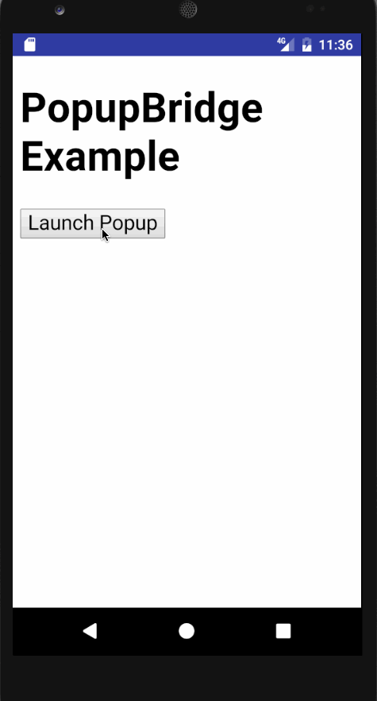

PopupBridge
============

[](https://travis-ci.org/braintree/popup-bridge-android)

PopupBridge is an Android library that allows WebViews to open popup windows in a browser and send data back to the parent page in the WebView.



:mega:&nbsp;&nbsp;A new major version of the SDK is available in beta. See the [v4 migration guide](v4_MIGRATION.md) for details.

PopupBridge is also available for [iOS](https://github.com/braintree/popup-bridge-ios).

See the [Frequently Asked Questions](#frequently-asked-questions) to learn more about PopupBridge. See [Using PayPal in a WebView](#using-paypal-in-a-webview) to use PopupBridge with PayPal.

Requirements
------------

- Android SDK 21

Installation
------------

Add the dependency in your `build.gradle`:

```groovy
dependencies {
  implementation 'com.braintreepayments.api:popup-bridge:4.1.0'
}
```

Quick Start
-----------

1. In the `AndroidManifest.xml`, add an `intent-filter` to your deep link destination Activity and register a custom URL scheme:

  ```xml
  <activity android:name="com.company.app.MyPopupBridgeActivity"
      android:launchMode="singleTask"
      android:exported="true">
      <intent-filter>
          <action android:name="android.intent.action.VIEW" />
          <category android:name="android.intent.category.DEFAULT" />
          <category android:name="android.intent.category.BROWSABLE" />
          <data android:scheme="my-custom-url-scheme" />
      </intent-filter>
  </activity>
  ```
Note: `android:exported` is required if your app compile SDK version is API 31 (Android 12) or later.
Note: The scheme you define must use all lowercase letters.

1. Instantiate a `PopupBridgeClient` in your app: 

   ```java
    package com.company.myapp;

    import com.braintreepayments.api.PopupBridgeClient;

    class MyWebViewActivity extends Activity {

        private WebView webView;
        private PopupBridgeClient popupBridgeClient;

        @Override
        protected void onCreate(@Nullable Bundle savedInstanceState) {
            super.onCreate(savedInstanceState);
            popupBridgeClient = new PopupBridgeClient(this, webView, "my-custom-url-scheme");
          
            // register error listener
            popupBridgeClient.setErrorListener(error -> showDialog(error.getMessage()));
        }

        @Override
        protected void onResume() {
            super.onResume();
            // call 'deliverResult' in onResume to capture a pending result
            popupBridgeClient.deliverPopupBridgeResult(this);
        }
   
        @Override
        protected void onNewIntent(Intent newIntent) {
            // required if your deep link destination activity launch mode is `singleTop`, `singleTask`, or `singleInstance`
            super.onNewIntent(newIntent);
            setIntent(newIntent);
        }
    }
   ```

1. Use PopupBridge from the web page by writing some JavaScript:

   ```javascript
   var url = 'http://localhost:4567/'; // the url you wish to open in a popup

   if (window.popupBridge) {
     // Open the popup in a browser, and give it the deep link back to the app
     popupBridge.open(url + '?popupBridgeReturnUrlPrefix=' + popupBridge.getReturnUrlPrefix());

     // Optional: define a callback to process results of interaction with the popup
     popupBridge.onComplete = function (err, payload) {
       if (err) {
         console.error('PopupBridge onComplete Error:', err);
       } else if (!err && !payload) {
         console.log('User closed popup.');
       } else {
         alert('Your favorite color is ' + payload.queryItems.color);

         console.log(payload.path) // defaults to ""
         console.log(payload.hash) // defaults to ""
       }
     };
   } else {
     var popup = window.open(url);

     window.addEventListener('message', function (event) {
       var color = JSON.parse(event.data).color;

       if (color) {
         popup.close();
         alert('Your favorite color is ' + color);
       }
     });
   }
   ```

1. Redirect back to the app inside of the popup:

   ```html
   <h1>What is your favorite color?</h1>

   <a href="#" data-color="red">Red</a>
   <a href="#" data-color="green">Green</a>
   <a href="#" data-color="blue">Blue</a>

   <script src="jquery.js"></script>
   <script>
   $('a').on('click', function (event) {
     var color = $(this).data('color');

     if (location.search.indexOf('popupBridgeReturnUrlPrefix') !== -1) {
       var prefix = location.search.split('popupBridgeReturnUrlPrefix=')[1];
       // Open the deep link back to the app, and send some data
       location.href = prefix + '?color=' + color;
     } else {
       window.opener.postMessage(JSON.stringify({ color: color }), '*');
     }
   });
   </script>
   ```

Frequently Asked Questions
--------------------------

### Why use PopupBridge?

By default, WebViews cannot open popups -- `window.open` will not work.

You can use [`setSupportMultipleWindows()`](https://developer.android.com/reference/android/webkit/WebSettings.html#setSupportMultipleWindows(boolean)) and [roll your own WebChromeClient and manage the windows yourself](http://maurizionapoleoni.com/blog/opening-a-window-open-in-android-without-killing-the-content-of-the-main-webview/), but this does not allow popups to communicate back to the parent WebView.

### What are some use cases for using PopupBridge?

- Apps with WebViews that need to open a popup
- When a popup window needs to send data from the popup back to the WebView
- When the popup window needs to display the HTTPS lock icon to increase user trust
- Apps that use OAuth

### How does it work?

- PopupBridge attaches to a WebView through the [Android JavaScript interface](https://developer.android.com/reference/android/webkit/WebView.html#addJavascriptInterface(java.lang.Object%2C%20java.lang.String))
  - This exposes a JavaScript interface (via `window.popupBridge`) for the web page to interact with the Android app code
- The web page detects whether the page has access to `window.popupBridge`; if so, it uses `popupBridge.open` to open the popup URL
  - `popupBridge.open` creates an Intent to open the popup URL, which Android forwards to the user's selected browser
  - The web page can also use `popupBridge.onComplete` as a callback
- The popup web page uses a deep link URL to return back to the app
  - The deep link is registered as a custom URL scheme in `AndroidManifest.xml`
  - One way to avoid hard-coding the deep link is by adding it as a query parameter to the popup URL:

    ```javascript
      popupBridge.open(url + '?popupBridgeReturnUrlPrefix=' + popupBridge.getReturnUrlPrefix());
    ```

    - Optionally, you can add path components, query parameters, hash values to the deep link URL to return data to the parent page, which are provided in the payload of `popupBridge.onComplete`
- If the user hits the back button or manually navigates back to the app, `popupBridge.onComplete` gets called with the error and payload as `null`

### Who built PopupBridge?

We are a team of engineers who work on the Developer Experience team at [Braintree](https://www.braintreepayments.com).

### Why did Braintree build PopupBridge?

Short answer: to accept PayPal as a payment option when mobile apps are using a WebView to power the checkout process.

PayPal used to support authentication via a modal iframe, but authentication now occurs in a popup window to increase user confidence that their account information is protected from malicious actors (the address bar shows `paypal.com` with the HTTPS lock icon). However, this causes issues with Braintree merchants who use a web page to power payments within their apps: they cannot accept PayPal because WebViews cannot open popups and return the PayPal payment authorization data to the parent checkout page.

PopupBridge solves this problem by allowing [`braintree-web`](https://github.com/braintree/braintree-web) or [PayPal's Checkout.js](https://github.com/paypal/paypal-checkout) to open the PayPal popup from a secure mini-browser.

Using PayPal in a WebView
-------------------------

WebView-based checkout flows can accept PayPal with PopupBridge and the [Braintree JS SDK](https://github.com/braintree/braintree-web) or [PayPal's Checkout.js](https://github.com/paypal/paypal-checkout). For the authentication flow, PayPal requires a popup window—which can be simulated with PopupBridge.

### Setup
1. Create a web-based checkout that accepts PayPal using Checkout.js or the Braintree JS SDK
1. Create a native mobile app that opens the checkout in a WebView (see steps 1-2 in quick start)
1. Integrate the PopupBridge library
1. Collect device data
    - To help detect fraudulent activity, collect device data before performing PayPal transactions. This is similar to collecting device data with our [native Android SDK](https://developer.paypal.com/braintree/docs/guides/paypal/vault/android/v4#collecting-device-data):
      1. Include `PayPalDataCollector` in your `build.gradle` dependencies, e.g. `compile 'com.paypal.android.sdk:data-collector:2.+'`
      1. Implement a method in your native app for sending device data. See the [Android code snippet for PayPal + PopupBridge](popupbridge-paypaldatacollector-android.md)
1. Profit!

## Author

Braintree, code@getbraintree.com

## License

PopupBridge is available under the MIT license. See the LICENSE file for more info.
